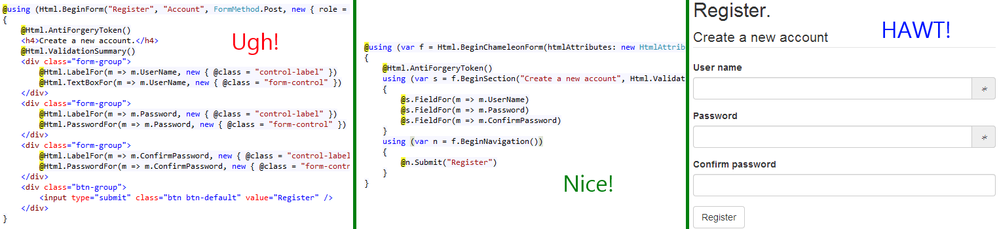
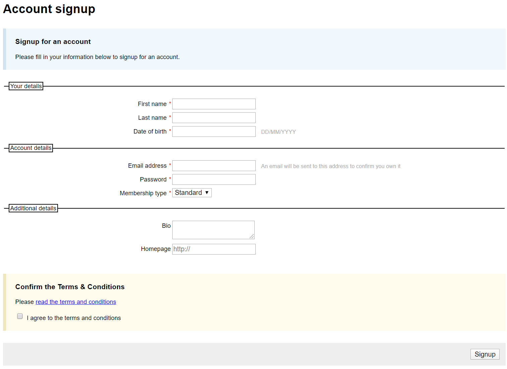

# ChameleonForms Documentation

## Overview
ChameleonForms takes away the pain and repetition of building forms with ASP.NET Core MVC by following a philosophy of:

* **Model-driven** defaults (e.g. enum is drop-down or radio list, collection/array of enums is a multi-select drop-down or checkbox list, `[DataType(DataType.Password)]` is password textbox, int is number textbox with a step of 1, etc.)
* **Extend the best of ASP.NET Core MVC** - makes use of HTML generation, client validation and model binding, but makes them work the way you'd expect in more scenarios so you spend more time pumping out business value and less time fighting and patching gaps in MVC
* **DRY** up your forms - your forms will be quicker to write and easier to maintain and you won't get stuck writing the same form boilerplate markup form after form after form
* **Consistent** - consistency of the API and form structure within your forms and consistency across all forms in your site via templating
* **Declarative** syntax - specify how the form is structured rather than worrying about the boilerplate HTML markup of the form
* **Beautiful, terse, fluent APIs** - it's a pleasure to read and write the code
* **Extensible and flexible** core - you can extend or completely change anything you want at any layer of ChameleonForms and you can drop out to plain HTML at any point in your form for those moments where pre-prepared field types and templates just don't cut it

It's ideally suited for situations where you want to **quickly** build forms that are highly consistent and maintainable. If you are trying to build highly specialised forms that are individually, painstakingly crafted then that's not what this library is for. That's where it makes sense to break out your JavaScript library of choice.

Here's a quick example of what ChameleonForms looks like compared to a traditional ASP.NET MVC approach:



## Contents

* [Example](#example)
    * [View model class](#view-model-class)
    * [Razor view](#razor-view)
    * [Rendered result](#rendered-result)
    * [Summary](#summary)
* [Documentation](#documentation)
    * [Basic usage](#basic-usage)
    * [Form structure](#form-structure)
    * [Field types](#field-types)
    * [Advanced usage](#advanced-usage)
    * [Philosophy](#philosophy)
* [Contributing](#contributing)
* [Support](#support)
* [Roadmap](#roadmap)

## Example

So, what does a ChameleonForms form look like? Check out the basic signup form example below.

### View model class

```csharp
public class SignupViewModel
{
    [Required]
    public string FirstName { get; set; }
    [Required]
    public string LastName { get; set; }
    [DisplayFormat(DataFormatString = "{0:d/M/yyyy}", ApplyFormatInEditMode = true)]
    public DateTime DateOfBirth { get; set; }

    [Required]
    [EmailAddress]
    public string EmailAddress { get; set; }
    [Required]
    [DataType(DataType.Password)]
    public string Password { get; set; }
    public MembershipType MembershipType { get; set; }

    [Url]
    public Uri Homepage { get; set; }
    [DataType(DataType.MultilineText)]
    public string Bio { get; set; }

    [Required]
    public bool TermsAndConditions { get; set; }
}
public enum MembershipType
{
    Standard,
    Bonze,
    Silver,
    Gold,
    Platinum
}
```

### Razor view

```csharp
@model SignupViewModel
<h1>Account signup</h1>
@using (var f = Html.BeginChameleonForm(htmlAttributes: Html.Attrs().Id("signup-form")))
{
    using (var m = f.BeginMessage(MessageType.Information, "Signup for an account"))
    {
        @m.Paragraph("Please fill in your information below to signup for an account.")
    }

    using (var s = f.BeginSection("Your details"))
    {
        @s.FieldFor(m => m.FirstName)
        @s.FieldFor(m => m.LastName)
        @s.FieldFor(m => m.DateOfBirth).WithHint("DD/MM/YYYY")
    }

    using (var s = f.BeginSection("Account details"))
    {
        @s.FieldFor(m => m.EmailAddress).WithHint("An email will be sent to this address to confirm you own it")
        @s.FieldFor(m => m.Password)
        @s.FieldFor(m => m.MembershipType)
    }

    using (var s = f.BeginSection("Additional details"))
    {
        @s.FieldFor(m => m.Bio).Rows(2).Cols(60)
        @s.FieldFor(m => m.Homepage).Placeholder("https://")
    }

    using (var m = f.BeginMessage(MessageType.Action, "Confirm the Terms & Conditions"))
    {
        @m.Paragraph(@<text>Please <a href="/terms">read the terms and conditions</a></text>)
        @f.FieldElementFor(mm => mm.TermsAndConditions).InlineLabel("I agree to the terms and conditions")
    }

    using (var n = f.BeginNavigation())
    {
        @n.Submit("Signup")
    }
}
```

### Rendered result

Here's what the rendered form looks like (using the default form template with some [light CSS applied](https://github.com/MRCollective/ChameleonForms/blob/master/ChameleonForms.Example/wwwroot/css/styles.css)):



Here's what the HTML looks like (using the default form template, which you can change):

```html
<h1>ChameleonForms example</h1>
<form action="" id="signup-form" method="post" novalidate="novalidate">      <div class="information_message">
          <h3>Signup for an account</h3>
          <div class="message">

<p>
    Please fill in your information below to signup for an account.
</p>          </div>
      </div>
    <fieldset>
        <legend>Your details</legend>
        <dl>
            <dt><label for="FirstName">First name</label> <em class="required">*</em></dt>
            <dd>
                <input data-val="true" data-val-required="The First name field is required." id="FirstName" name="FirstName" required="required" type="text" value="" /> <span class="field-validation-valid" data-valmsg-for="FirstName" data-valmsg-replace="true"></span>
            </dd>
            <dt><label for="LastName">Last name</label> <em class="required">*</em></dt>
            <dd>
                <input data-val="true" data-val-required="The Last name field is required." id="LastName" name="LastName" required="required" type="text" value="" /> <span class="field-validation-valid" data-valmsg-for="LastName" data-valmsg-replace="true"></span>
            </dd>
            <dt><label for="DateOfBirth">Date of birth</label> <em class="required">*</em></dt>
            <dd>
                <input aria-describedby="DateOfBirth--Hint" data-val="true" data-val-date="The field Date of birth must be a date with format d/M/yyyy." data-val-format="d/M/yyyy" data-val-required="The Date of birth field is required." id="DateOfBirth" name="DateOfBirth" required="required" type="text" value="" /><div class="hint" id="DateOfBirth--Hint">DD/MM/YYYY</div> <span class="field-validation-valid" data-valmsg-for="DateOfBirth" data-valmsg-replace="true"></span>
            </dd>
        </dl>
    </fieldset>
    <fieldset>
        <legend>Account details</legend>
        <dl>
            <dt><label for="EmailAddress">Email address</label> <em class="required">*</em></dt>
            <dd>
                <input aria-describedby="EmailAddress--Hint" data-val="true" data-val-required="The Email address field is required." id="EmailAddress" name="EmailAddress" required="required" type="email" value="" /><div class="hint" id="EmailAddress--Hint">An email will be sent to this address to confirm you own it</div> <span class="field-validation-valid" data-valmsg-for="EmailAddress" data-valmsg-replace="true"></span>
            </dd>
            <dt><label for="Password">Password</label> <em class="required">*</em></dt>
            <dd>
                <input data-val="true" data-val-required="The Password field is required." id="Password" name="Password" required="required" type="password" /> <span class="field-validation-valid" data-valmsg-for="Password" data-valmsg-replace="true"></span>
            </dd>
            <dt><label for="MembershipType">Membership type</label> <em class="required">*</em></dt>
            <dd>
                <select data-val="true" data-val-required="The Membership type field is required." id="MembershipType" name="MembershipType" required="required"><option selected="selected" value="Standard">Standard</option>
<option value="Bonze">Bonze</option>
<option value="Silver">Silver</option>
<option value="Gold">Gold</option>
<option value="Platinum">Platinum</option>
</select> <span class="field-validation-valid" data-valmsg-for="MembershipType" data-valmsg-replace="true"></span>
            </dd>
        </dl>
    </fieldset>
    <fieldset>
        <legend>Additional details</legend>
        <dl>
            <dt><label for="Bio">Bio</label></dt>
            <dd>
                <textarea cols="60" id="Bio" name="Bio" rows="2">
</textarea> <span class="field-validation-valid" data-valmsg-for="Bio" data-valmsg-replace="true"></span>
            </dd>
            <dt><label for="Homepage">Homepage</label></dt>
            <dd>
                <input id="Homepage" name="Homepage" placeholder="http://" type="url" value="" /> <span class="field-validation-valid" data-valmsg-for="Homepage" data-valmsg-replace="true"></span>
            </dd>
        </dl>
    </fieldset>
      <div class="action_message">
          <h3>Confirm the Terms & Conditions</h3>
          <div class="message">

<p>
    Please <a href="#">read the terms and conditions</a>
</p><input data-val="true" data-val-required="The Terms and conditions field is required." id="TermsAndConditions" name="TermsAndConditions" required="required" type="checkbox" value="true" /> <label for="TermsAndConditions">I agree to the terms and conditions</label>          </div>
      </div>
        <div class="form_navigation">
<button type="submit">Signup</button>        </div>
    </form>
```

### Summary

Key things to note that ChameleonForms has automatically done (with default configuration):

* HTML 5 validation turned off (instead unobtrusive validation provides a better exerience)
* The form performs a POST to the current URL (i.e. self-submitting form)
* Fields are grouped into sections with fieldsets
* All boilerplate HTML surrounding a field, its label (with correct `for`), its hint (if any) and its validation message is added for you just by specifying the view model property - this means:
    * You can switch a form template once globally and all forms will automatically change
    * You can be confident all fields have labels, validation HTML etc. that are correctly hooked up and you haven't misspelt any IDs etc.
    * Similarly, you can be sure that all fields will definitely bind to the view model when posted back to the server
    * The form is much quicker to write and read since it's way terser
* The correct field types have automatically been inferred, including HTML 5 field types where they are useful (e.g. not for dates since you have no control over date format):
    * `string` -> `<input type="text">`
    * `[EmailAddress]` -> `<input type="email">`
    * `[DataType(DataType.Password)]` -> `<input type="password">`
    * `MembershipType` (enum) -> `<select>` (Can easily be made a radio list with `.AsRadioList()`)
    * `[Url]` -> `<input type="url">`
    * `[DataType(DataType.MultilineText)]` -> `<textarea>`
    * `bool` -> `<input type="checkbox">`
* Required fields (either with `[Required]` or via a non-nullable value type) automatically have `data-val-required`, `required="required"` and visual required designators added to them
* Labels are automatically human readable e.g. `public string FirstName { get; set; }` became `First name` without us having to specify that
* Client-side validation and server-side validation has been added for the `DateTime` that is Format-aware (based on `[DisplayFormat(DataFormatString = "{0:d/M/yyyy}", ApplyFormatInEditMode = true)]`)
* Hints are automatically attached to their field for screen readers via the `aria-describedby` attribute

## Documentation

### Philosophy
* [Why is ChameleonForms needed](why.md) - A rant about building forms and why ChameleonForms removes a lot of the pain
* We expect that you know how to use ASP.NET Core MVC's form generation, model-binding and validation support to be able to effectively use and understand this library. If you need a hand getting started with that knowledge then check out the following: [Understanding HTML Helpers in ASP.NET MVC](https://www.dotnettricks.com/learn/mvc/understanding-html-helpers-in-aspnet-mvc) (out of date since it's targetting pre-.NET Core, but the concepts still apply in ASP.NET Core), [tag helpers](https://docs.microsoft.com/en-us/aspnet/core/mvc/views/working-with-forms?view=aspnetcore-3.1), [model binding](https://docs.microsoft.com/en-us/aspnet/core/mvc/models/model-binding?view=aspnetcore-3.1), [validation](https://docs.microsoft.com/en-us/aspnet/core/mvc/models/validation?view=aspnetcore-3.1).

### Basic usage
* [Getting started](getting-started.md) - What does ChameleonForms do for me? How are ChameleonForms forms structured? What terminology is used in ChameleonForms?
* [Comparison](comparison.md) - See an example of a ChameleonForms form versus an out-of-the-box ASp.NET MVC form (HTML Helpers, Editor Templates and *(coming soon)* Tag Helpers)
* [Changing to Twitter Bootstrap 3 template](bootstrap-template.md) - Changing from the default template to the Twitter Bootstrap template *(Bootstrap 4 support coming soon)*
* [Automatically sentence case form labels](auto-sentence-case.md) - Automatic sentence casing your form labels without having to annotate them with `[DisplayName]`
* [Field Configuration](field-configuration.md) - An overview of the common options available to configure a form field via the `IFieldConfiguration` interface
* [HTML Attributes](html-attributes.md) - An overview of how to define HTML attributes using the `HtmlAttributes` class
* [Change the model type for portions of your page](html-helper-context.md)
* [Create a form against a model type different from the page model](different-form-models.md)
* [Use partial views for repeated or abstracted form areas](partials.md)

### Form structure
Examples for generating a form and each type of default component within the form. The following pages show both the ChameleonForms syntax, as well as the default generated HTML (which you can easily override to suit your own needs).

* [Form](the-form.md) - How to output and configure the containing form
* [Message](the-message.md) - How to output and configure a message
* [Section](the-section.md) - How to output and configure a form section
* [Navigation](the-navigation.md) - How to output and configure a form navigation area and add buttons to it
* [Field](field.md) - How to output and configure templated fields
    * [Field Element](field-element.md) - How to output the HTML for a field
    * [Field Label](field-label.md) - How to output and configure field labels
    * [Field Validation HTML](field-validation-html.md) - How to output validation messages for a field

### Field types
* [Boolean fields](boolean.md) - Display booleans as a single checkbox, a select-list or a list of radio checkboxes
* [DateTime fields](datetime.md) - Display DateTimes as a text box including model binding and client-side validation that respects `[DisplayFormat]`
    * [Client-side validation of DateTime fields](datetime-client-side-validation.md) - How to use `jquery.validate.unobtrusive.chameleon.js`
* [Enum fields](enum.md) - Display enums as drop-downs or a list of radio buttons
* [Flags enum fields](flags-enum.md) - Display flags enums as multi-select drop-downs or a list of checkboxes
* [Multiple-select enum fields](multiple-enum.md) - Display enums as multi-select drop-downs or a list of checkboxes
* [List fields](list.md) - Display drop-downs or lists of radio buttons to allow users to select an item from a list
* [Multiple-select list fields](multiple-list.md) - Display multi-select drop-downs or lists of checkboxes to allow users to select multiple items from a list
* [Textarea fields](textarea.md) - Display textarea fields
* [File upload fields](file-upload.md) - Display file-upload fields
* [Password fields](password.md) - Display password fields
* [Number fields](number.md) - Display number fields
* [Default (`<input type="text" />`) fields](default-fields.md)

### Advanced usage
* [Using different form templates](form-templates.md)
* [Creating custom form templates](custom-template.md)
* [Extending the field configuration](extending-field-configuration.md)
* [Extending the form components](extending-form-components.md)
* [Creating and using a custom field generator](custom-field-generator.md)
* [Creating and using custom field generator handlers](custom-field-generator-handlers.md)

## Contributing
If you would like to contribute to this project then feel free to communicate with us via Twitter [@robdmoore](http://twitter.com/robdmoore) / [@mdaviesnet](http://twitter.com/mdaviesnet) or alternatively send a pull request / issue to the [GitHub project](https://github.com/MRCollective/ChameleonForms/).

## Support
If you need to raise an issue or check for an existing issue, see <https://github.com/MRCollective/ChameleonForms/issues>.

## Roadmap

Some ideas for the library in the future are:

* Ability to opt-in to switch on HTML 5 validation and switch off client validation
* Bootstrap 4 and Material UI support
* Tag helpers
* Blazor, Razor Pages and Carter support
* Support `IList<nullable<value type>>` (doesn't bind well in ASP.NET Core MVC - needs to be patched)
